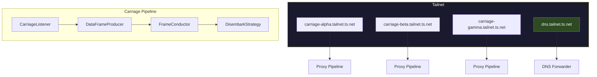
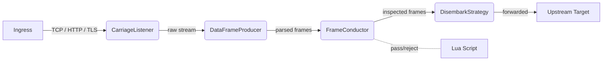

# Railscale

A scriptable, Tailscale-native network service. Each **carriage** is an independent Tailscale node with its own hostname, running a configurable proxy forwarding pipeline. Behavior is scripted via Lua.

## Architecture

## Carriage Pipeline

Each carriage runs the same four-stage pipeline:

| Stage | Trait | Role |
|-------|-------|------|
| **Listen** | `CarriageListener` | Accept connections on this carriage's tailnet address |
| **Parse** | `DataFrameProducer` | Read and buffer frames from the connection |
| **Inspect** | `FrameConductor` | Evaluate frames against rules (Lua-scriptable) |
| **Forward** | `DisembarkStrategy` | Write frames to the upstream destination |

## Key Concepts

- **Carriage** -- a self-contained Tailscale service with its own hostname, its own listener, and its own forwarding rules
- **DNS Server** -- runs as a separate service, not part of the carriage pipeline
- **Lua scripting** -- defines per-carriage behavior: routing, filtering, inspection logic
- **rsnet** -- Rust Tailscale integration, each carriage gets its own `rsnet` instance
